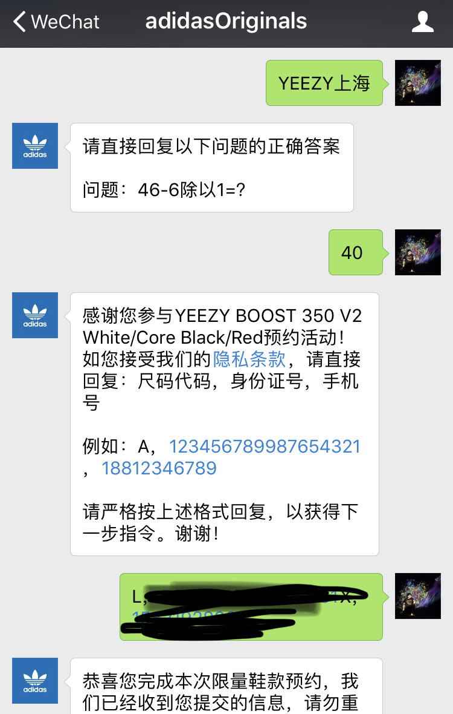

# adidasOriginals
Apply adidas origins snickers using [itchat api](https://github.com/littlecodersh/itchat)

# Usage
Edit the configuration file `ID.config`;

    $pip3 install itchat
    $python test.py

Then scan QR.png to login Wechat Web. This script aims to auto-reply authentication information like this:

If you do not want to stay logged in, delete `hotReload=True` in `main.py #94`. See more [info](https://itchat.readthedocs.io/zh/latest/)
